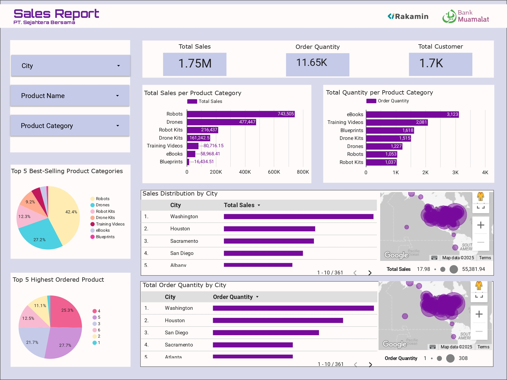

# **Muamalat Sales Intelligence Dashboard**

### *Business Intelligence Project — Bank Muamalat x Rakamin Academy*

This repository presents a comprehensive analytical workflow designed to support **data-driven commercial decision-making**.
The project integrates multiple operational datasets into a unified analytical environment using **Google BigQuery**, **Looker Studio**, and a structured relational data model to deliver insights on **revenue performance**, **regional distribution**, and **product profitability**.

---


<p align="center">
  
</p>


---

# **1.Summary**

This project consolidates sales, customer, product, and category data to produce a **single source of truth** for commercial reporting.
The resulting dashboard provides:
- Visibility into top revenue and volume drivers
- Clarity on regional contribution pattern
- Identification of product mix concentration
- Insight into customer purchasing behavior

The analytical lifecycle includes:

**data ingestion, standardization, relational modelling, master table creation, dashboard visualitation, strategic interpretation**


# **2. Repository Structure**

```
Muamalat-Sales-Intelligence-Dashboard/
│
├── data/
│   ├── raw                      # Original datasets
│   └── processed                # Cleaned & structured datasets
│
├── erd/
│   ├── erd.png                  # Entity Relationship Diagram
│   └── erd.sql                  # Schema definition
│
├── queries/
│   └── table master.sql         # Master dataset creation in BigQuery
│
├── report/
│   ├── dashboard.pdf            # Exported Looker dashboard
│   └── dashboard.pptx           # Presentation slides
│
└── README.md
```

---

# **3. Data Architecture & Modelling**

A relational data model was designed to integrate four key datasets:

Datasets
- Customers
- Products
- Product Categories
- Orders

All datasets were standardized (XLSX → CSV), quality-checked, and imported into **Google BigQuery**.

Primary Keys
- `CustomerID`
- `ProdNumber`
- `CategoryID`
- `OrderID`

Relationship Structure
- Customers → Orders: **1:M**
- Products → Orders: **1:M**
- Categories → Products: **1:M**

ERD
[https://dbdiagram.io/d/ERD-692848c4a0c4ebcc2bfedd9f](https://dbdiagram.io/d/ERD-692848c4a0c4ebcc2bfedd9f)
The model supports a clean and scalable environment for reporting and analysis.


# **4. Master Table Development**

A unified **master dataset** was created by joining customer, product, category, and order entities.
This dataset serves as the foundation for all metrics used in the dashboard, providing:

* Consistent product hierarchy
* Accurate pricing and quantity aggregation
* Standardized geographic segmentation
* Reliable transaction-level analysis

SQL logic is available in: `/queries/table master.sql`

---

# **5. Dashboard Overview**

🔗 **Live Looker Studio Dashboard**
[https://lookerstudio.google.com/reporting/e9b07c09-0867-4b12-879e-6b3f0146192b](https://lookerstudio.google.com/reporting/e9b07c09-0867-4b12-879e-6b3f0146192b)

### **Key Components**

- Sales & Quantity by Product Category
- Top 5 Best-Selling Categories
- Top 5 Most-Ordered Products
- Sales Performance by City
- Order Volume Distribution by City
- Geographic & Sales Clusters

The dashboard is structured to provide clear and actionable commercial insights.


# **6. Key Insights**

**Product Performance**

- Robots & Drones generate the majority of revenue.
- eBooks & Training Videos dominate volume but contribute minimally to revenue.
- Product demand is concentrated in a limited number of categories.

**Regional Performance**
- Washington leads significantly in revenue and order count.
- Several regions underperform, creating geographic imbalance.
- Houston and Sacramento display strong potential for expansion.

**Customer Behavior**
- High-frequency purchases occur in low-value digital products.
- Transition to premium hardware remains limited.
- Volume is strong, but value per transaction is relatively low.


# **7. Strategic Impact**

The analysis highlights several areas of importance:

1. Revenue Concentration
Dependence on premium hardware categories and one primary region increases business sensitivity.

2. Geographic Diversification
Expanding performance across more cities is essential for improving long-term revenue stability.

3. Upsell Potential
Digital-product buyers represent a viable segment for premium product conversion.

4. Product Mix Optimization
Strengthening mid-tier product adoption can help balance overall portfolio contribution.

# **8. Summary**

The business currently demonstrates:
- High transaction volume from low-value products
- Revenue driven by a narrow set of premium categories
- A geographic footprint dominated by one region

To support sustainable growth, the organization should prioritize:

- Geographic expansion
- Upsell strategies
- Product portfolio diversification

This project provides a structured and data-backed foundation for commercial planning and decision-making.

---

# **9. Author**

**Nicki D. Utomo**
Bank Muamalat x Rakamin — Project-Based Internship
